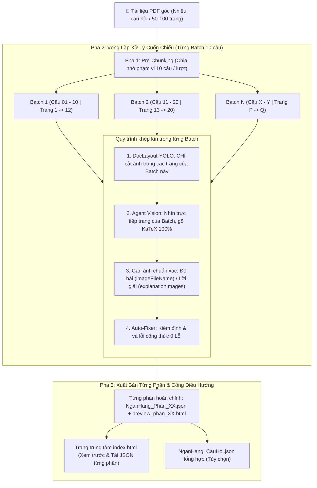

# New-convert-bank Skill (Next-Gen Question Bank Converter)

Skill này quy định quy trình chuyển đổi tài liệu Toán học (PDF, đề thi, chuyên đề) thành **Ngân hàng câu hỏi chuẩn JSON** nạp vào hệ thống **MathLearn Website**, sử dụng công nghệ **Marker 2.0 AI Engine** (hoặc **Local AI DocLayout-YOLO** + **Multi-Agent Vision**) và **Node.js Auto-Fixer**.

---

## 🌟 Điểm Cải Tiến Đột Phá So Với Quy Trình Cũ

| Tính năng | Quy trình cũ (`question-bank-converter`) | Quy trình mới (`New-convert-bank` + Marker 2.0) |
| :--- | :--- | :--- |
| **OCR Công thức Toán** | PyMuPDF text thô (vỡ phân số/MathType) | **Marker 2.0 AI:** Tự động dịch phân số, căn thức, hệ PT sang LaTeX chuẩn |
| **Bóc tách hình vẽ** | Snipping Tool cắt tay từng ảnh | **Tự động 100%:** Marker trích xuất Figure hoặc Local DocLayout-YOLO |
| **Tốc độ xử lý (100 trang)** | 20–30 phút cắt tay + 20 phút Vision API | **~30 – 60 giây (Chạy Local 100% trên GPU/CPU)** |
| **Sửa lỗi cú pháp KaTeX**| Báo log và phải sửa tay từng câu | **Script `auto_fix_bank_json.js` tự động vá 0 Lỗi trong 2 giây** |
| **Kiểm tra trực quan** | Không có giao diện kiểm tra nhanh | **Tự động xuất `preview.html` 2 cột** mở xem ngay trên trình duyệt |

---

## 1. Cấu Trúc JSON Ngân Hàng Câu Hỏi Chuẩn

File JSON nạp vào MathLearn Website phải tuân thủ schema:

```json
{
  "version": 1,
  "kind": "question_bank",
  "questions": [
    {
      "text": "Cho hàm số $y = x^3 - 3x + 2$. Giá trị cực đại bằng:",
      "type": "multiple_choice",
      "difficulty": "nhan_biet",
      "grade": "Lớp 12",
      "topicIds": ["ham-so-va-do-thi"],
      "options": ["$-1$.", "$0$.", "$1$.", "$4$."],
      "correctIndex": 3,
      "points": 1,
      "explanation": "Ta có $f'(x) = 3x^2 - 3 = 0 \\Leftrightarrow x = \\pm 1$.\nBảng biến thiên cho thấy giá trị cực đại bằng $4$.",
      "explanationImageFileName": "lt_1.png"
    }
  ]
}
```

### 9 Mã Chủ Đề Hợp Lệ (`topicIds`):
`ham-so-va-do-thi`, `mu-va-logarit`, `dao-ham`, `nguyen-ham-va-tich-phan`, `luong-giac`, `day-so-va-gioi-han`, `hinh-hoc-khong-gian`, `vector-va-he-toa-do`, `xac-suat-va-thong-ke`.

---

## 2. Quy Trình Chuẩn Hóa: Cuốn Chiếu Từng Batch (Batch-by-Batch Pipeline)

> [!IMPORTANT]
> **QUY TẮC BẤT KHẢ XÂM PHẠM: TUYỆT ĐỐI KHÔNG CẮT TOÀN BỘ ẢNH TRONG 1 LẦN!**
> 
> **Nguyên nhân cốt lõi: Chống Lỗi Domino / Lệch Pha Dây Chuyền (Domino Cascade Failure Prevention):**
> * Nếu cắt toàn bộ 100+ ảnh cùng một lúc từ 90 trang PDF, **chỉ cần 1 trang bị nhận diện sót hoặc thừa 1 ảnh** (ví dụ trang 15 thừa 1 ảnh rác), toàn bộ 80 ảnh phía sau sẽ bị **dịch chuyển chỉ số (+1 hoặc -1)**. Hậu quả là hàng chục câu hỏi phía sau sẽ bị **gắn sai ảnh đồ thị/bảng biến thiên hàng loạt**.
> * **Giải pháp bắt buộc: CHIA NHỎ TÀI LIỆU TRƯỚC KHI CẮT (Pre-Chunking 10 câu/lượt).** Mỗi batch 10 câu chỉ chứa từ 3–8 ảnh cục bộ. Dù bất kỳ batch nào có lỗi thì lỗi đó cũng bị **cô lập hoàn toàn**, không bao giờ lan truyền làm sai lệch các phần khác. Đồng thời Agent Vision kiểm soát đối chiếu tức thì ngay trong phạm vi hẹp 10 câu.



---

### Chi Tiết 3 Pha Chuẩn Hóa:

#### Pha 1: Chia nhỏ phạm vi tài liệu (Pre-Chunking)
- Xác định cấu trúc tài liệu, phân nhóm mỗi batch gồm **10 câu hỏi** (ví dụ: Câu 1–10, Câu 11–20,...).
- Xác định chính xác phạm vi trang PDF tương ứng với từng batch (ví dụ: Batch 1 từ Trang 1 đến Trang 12).

#### Pha 2: Xử lý trọn gói độc lập trong từng Batch
Với mỗi batch 10 câu:
1. **Cắt ảnh cục bộ bằng DocLayout-YOLO:**
   - **Chỉ quét và crop các hình vẽ trong phạm vi trang của batch đó.**
   - Lưu ảnh vào thư mục `figures/` của batch (số lượng ảnh mỗi batch chỉ khoảng 5–15 ảnh, hoàn toàn không gây tải hệ thống hay nhầm lẫn thứ tự).
2. **Biên soạn bằng Agent Vision:**
   - Agent Vision nhìn trực quan các trang của batch, gõ lại 100% câu chữ và công thức KaTeX chuẩn (`\frac{...}{...}`, `\sqrt{...}`, `\begin{cases}`, số thập phân `$0{,}5$`).
   - Gán ảnh trực tiếp từ kho ảnh vừa cắt của batch vào đúng đề bài (`imageFileName`) hoặc lời giải (`explanationImageFileName` / `explanationImages`).
3. **Kiểm định & Tự động vá lỗi:**
   - Chạy `auto_fix_bank_json.js` để vá lỗi KaTeX tự động cho batch.
   - Xuất file JSON thành phần: `NganHang_Phan_01_Cau_01_10.json`.
   - Xuất file HTML xem trước: `preview_phan_01.html` (nhẹ, mở tức thì, 0 giật lag).

#### Pha 3: Ghép nối & Xuất bản Cổng điều hướng (`index.html`)
- Tự động sinh trang [`index.html`](#) điều hướng toàn bộ các phần, cho phép giáo viên/người dùng click xem trước hoặc tải JSON từng phần 10 câu chỉ với 1 click.
- Tự động tạo file tổng hợp `NganHang_CauHoi.json` phục vụ nhập liệu hàng loạt khi cần.

---

## 3. Lệnh Tự Động Hóa Toàn Diện (All-in-One CLI)

Chỉ cần chạy 1 lệnh duy nhất để hoàn tất trọn gói từ PDF sang JSON + Preview HTML:

```bash
# Mặc định: Tự động dùng Marker 2.0 AI Engine (siêu tốc ~30-60s)
python .agents/skills/new-convert-bank/scripts/build_full_question_bank.py "<file.pdf>" "<output_dir>" --topic "ham-so-va-do-thi" --grade "Lớp 12" --type "short_answer"

# Ép dùng Marker Engine:
python .agents/skills/new-convert-bank/scripts/build_full_question_bank.py "<file.pdf>" "<output_dir>" --engine marker

# Dùng Legacy Engine (PyMuPDF + DocLayout-YOLO):
python .agents/skills/new-convert-bank/scripts/build_full_question_bank.py "<file.pdf>" "<output_dir>" --engine legacy
```

* **Các tùy chọn `--type`:**
  - `short_answer` *(Trả lời ngắn - mặc định)*
  - `multiple_choice` *(Trắc nghiệm 4 đáp án)*
  - `true_false` *(Đúng / Sai)*
  - `essay` *(Tự luận)*
  - `auto` *(Tự động nhận diện)*
* **Tùy chọn `--page-range`:** Giới hạn trang cần xử lý (ví dụ: `0-10`).
* **Tùy chọn `--skip-crop`:** Tận dụng thư mục ảnh `figures/` đã cắt trước đó.

---

## 4. Cơ Chế Chia Nhỏ Ngân Hàng Câu Hỏi (Part Chunking & Index Portal)

Khi một bộ đề hoặc ngân hàng câu hỏi có dung lượng lớn (từ 20–70+ câu hỏi kèm nhiều hình vẽ và lời giải chi tiết dài), việc dồn toàn bộ vào một file duy nhất có thể gây giật lag trình duyệt khi dựng hàng trăm công thức KaTeX cùng lúc.

Quy trình chuẩn hóa cung cấp script tự động chia nhỏ:

```bash
# Chia nhỏ ngân hàng câu hỏi thành các phần (mỗi phần 15 câu):
python .agents/skills/new-convert-bank/scripts/split_question_bank.py "<path_to_NganHang_CauHoi.json>"
```

### Kết quả xuất ra:
1. **Các file JSON thành phần:** `NganHang_Phan_01_Cau_01_15.json`, `NganHang_Phan_02_Cau_16_30.json`,...
2. **Các trang Preview HTML riêng:** `preview_phan_01.html`, `preview_phan_02.html`,... (tải siêu tốc, mượt mà, không giật lag).
3. **Trang điều hướng trung tâm (`index.html`):** Giao diện cổng thông tin tổng hợp trực quan, cho phép người dùng click mở xem trước bất kỳ phần nào hoặc tải JSON tương ứng chỉ với 1 click.

---

## 5. Bộ Script Đi Kèm (Tất cả lưu tại Ổ D)

| Script | Đường dẫn | Chức năng |
| :--- | :--- | :--- |
| **`build_full_question_bank.py`** | `d:/DayThem/Website/.agents/skills/new-convert-bank/scripts/build_full_question_bank.py` | **Script All-in-One:** Tự động hóa trọn gói 3 Pha. Hỗ trợ `--engine marker\|legacy\|auto`. |
| **`split_question_bank.py`** | `d:/DayThem/Website/.agents/skills/new-convert-bank/scripts/split_question_bank.py` | **Chia nhỏ ngân hàng câu hỏi:** Tách JSON thành từng phần nhỏ (15 câu) + tạo `index.html` & preview riêng. |
| **`marker_extract.py`** | `d:/DayThem/Website/.agents/skills/new-convert-bank/scripts/marker_extract.py` | Engine Marker 2.0: Bóc tách PDF sang Markdown + LaTeX + Ảnh trong ~30-60s. |
| **`marker_md_parser.py`** | `d:/DayThem/Website/.agents/skills/new-convert-bank/scripts/marker_md_parser.py` | Parser bóc tách Markdown của Marker thành cấu trúc JSON câu hỏi MathLearn. |
| **`auto_crop_figures.py`** | `d:/DayThem/Website/.agents/skills/new-convert-bank/scripts/auto_crop_figures.py` | Tự động phát hiện và crop sạch hình vẽ qua Local DocLayout-YOLO. |
| **`auto_fix_bank_json.js`** | `d:/DayThem/Website/.agents/skills/new-convert-bank/scripts/auto_fix_bank_json.js` | Tự động sửa lỗi `$`, `{}`, kiểm định bằng KaTeX engine đạt **0 Lỗi**. |
| **`generate_preview.js`** | `d:/DayThem/Website/.agents/skills/new-convert-bank/scripts/generate_preview.js` | Xuất trang HTML xem trước KaTeX + Ảnh thẻ dọc độc lập. |
| **`extract_pdf_pages.py`** | `d:/DayThem/Website/.agents/skills/new-convert-bank/scripts/extract_pdf_pages.py` | Xuất PDF thành ảnh 200 DPI. |
| **`validate_bank_json.js`** | `d:/DayThem/Website/.agents/skills/new-convert-bank/scripts/validate_bank_json.js` | Linter kiểm định chất lượng JSON (báo cáo lỗi/cảnh báo chi tiết). |
| **Model Weights** | `d:/DayThem/Website/.agents/skills/new-convert-bank/models/doclayout_yolo_docstructbench_imgsz1024.pt` | File trọng số AI cục bộ (~40.7MB). |


